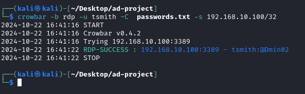

<h1>JWipe - Active directory Lab</h1>

<h2>Description</h2>
In this project I create a server for a faux company to exist on, both target and attacking virtual machines, workstation logins for a few users, and then I use crowbar to instigate a brute force attack on the target machine. Afterwards all of the data will be ingested and processed through a splunk virtual machine. Before I forget I also need to mention here that I followed a guide to set this up. I followed MyDFIR's guide on youtube. Thank you for the fantastic guide!
<br />


<h2>Project Diagram</h2>


<h2>Environments Used </h2>

- <b>VirtualBox</b>
- <b>Windows 10 (target machine)</b>
- <b>Kali Linux (attacking machine)</b>
- <b>Splunk (data collection and processing)</b>

<h2>Project Walkthrough:</h2>


<b>The first thing that needs to be done is to create 4 different virtual machines. This is a very easy and repetitive process so I will post a seperate guide on how to set these machines up at a later date and link back to it here so that I can keep this report as short as possible. the machines we need to set up are as follows: </b>

 - <b>Windows 10 machine to be the target</b>
 - <b>Windows 10 server to host the target machine on a domain</b>
 - <b>Kali linux machine to attach the target machine</b>
 - <b>Splunk server to injest and process the data</b>
 
 <h2>configuring the machines:</h2>
 <b>Once the machines have been set up they need to be configured to have static ip's. </b>
 <b>The process is slightly different based on the opperating system of the machine in question but we just need to set the static ip's to match out diagram. for example with our splunk machine:<b/>
  
 

 <b>Below are some of the "ip a" commands and ping commands to google.com I ran to confirm things were running propperly.

 

 

 


 <h2>Creating Org Units and Users</h2>
 <b>Our next task is to set up a domain, create organizational units, and create some users. Just like before to avoid bloating this project too much Ill make a seperate post on how to create a domain and link to it here. 
 Once you have a domain set up all that needs to be done is to navigate to the organizational units on the domain settings and add some new ones. I added "IT" and "HR" as depicted below.<b/>

 

  <b> And here is an example user that I set up:

 
  
<b> As a side note I would like to mention that I set up another user named Terry Smith who I chose to be the target of the attacks.<b/>

  <h2>The Attack!</h2>
  <b> with all of the configuration out of the way its time to start setting up the attack. The first thing we need to do is insure that the password list that we will feed into crowbar contains the passwords that I used to create these users accounts. Below is the list of passwords that I used. You can see there are 21 passwords on this list. The last password belongs to Terry Smith.</b>

   

<b>Now we can feed these passwords into crowbar and begin the attack. When we do that you can see we successfully breached remote desktop protocol as indicated by the "RDP-SUCCESS" message seen here:</b>



<b>Now that we have succesfully attacked Terry Smiths account its time to check the data.

<h2>The Data</h2>

<b>The first thing I wanted to check splunk was identifying the workstation propperly. You cn see from the picture below that it identified the workstation "tsmith" which is shorthand for Terry smith. Things checks out so far.</b>


<b>Now that we know we are looking at the correct data we can check out the events that splunk tracked, but before we do that we need to quickly talk about event codes. Event codes are a set of numbers that represent different types of events that occur. The event code for a log on attempt is 4265 and if the log on attempt was successfull an the additional event code 4264 will show up to reflect that. if we search for these events we see that there were 105 log on attempts and 5 of those attempts were successfull. These numbers make sense because I ran the attack 5 seperate times. As a side note you will also notice the 4634 event code showing up 5 times. This code just indicated a log on was terminated.</b>


<b>When we check the workstation name for these events we can see the workstation name of kali. This is a clear indicator that Terry Smith's account was breached.<b/>


<b>One final thing I wanted to mention in regards to this data as a final indicator of comromise is that all of these events happen at virtually the same time. You can see from the image below that the time stamp on these events are identical.</b>


<h2>Atomic Red Team</h2>

<b>The last thing I did with this project was to install atomic red team and test some additional weaknesses. For example I tested if the domain was susceptible to attackers creating new users. Notice the name "NewLocalUser" that was created when I ran this test.</b>


<b>Now when we look for active users we can see the new account! This is definately a vulnerability.</b>


<h2>Conclusion</h2>

<b>That wraps up the project! Hopefully you have enjoyed it! and again I'd like to give a special thanks to MyDFIR for providing an excellent guide!</b>


</p>

<!--
 ```diff
- text in red
+ text in green
! text in orange
# text in gray
@@ text in purple (and bold)@@
```
--!>
