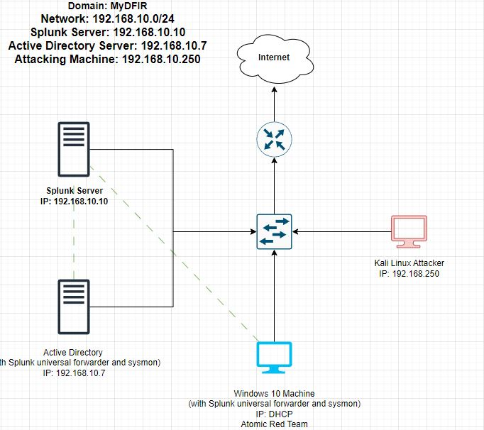

<h1>JWipe - Active directory Lab</h1>

<h2>Description</h2>
In this project I create a server for a faux company to exist on, both target and attacking virtual machines, workstation logins for a few users, and then I use crowbar to instigate a brute force attack on the target machine. 
Afterwards all of the data will be ingested and processed through a splunk virtual machine.
<br />


<h2>Project Diagram</h2>



<h2>Environments Used </h2>

- <b>Windows 10 (target machine)</b>
- <b>Kali Linux (attacking machine)</b>
- <b>Splunk (data collection and processing)</b>

<h2>Project Walkthrough:</h2>


<b>The first thing that needs to be done is to create 4 different virtual machines. This is a very easy and repetitive process so I will post a seperate guide on how to set these machines up at a later date and link back to it here so that I can keep this report as short as possible. the machines we need to set up are as follows: </b>

 - <b>Windows 10 machine to be the target</b>
 - <b>Windows 10 server to host the target machine on a domain</b>
 - <b>Kali linux machine to attach the target machine</b>
 - <b>Splunk server to injest and process the data</b>
 
 <h2>configuring the machines:</h2>
 <b>Once the machines have been set up they need to be configured to have static ip's. </b>
 <b>The process is slightly different based on the opperating system of the machine in question but we just need to set the static ip's to match out diagram. for example with our splunk machine:<b/>
  
 

 <h2>Creating Org Units and Users</h2>
 <b>Our next task is to set up a domain, create organizational units, and create some users. Just like before to avoid bloating this project too much Ill make a seperate post on how to create a domain and link to it here. 
 Once you have a domain set up all that needs to be done is to navigate to the organizational units on the domain settings and add some new ones. I added "IT" and "HR" as depicted below.<b/>

 
  
<br />
Select the disk:  <br/>

<br />
<br />
Enter the number of passes: <br/>

<br />
<br />
Confirm your selection:  <br/>

<br />
<br />
Wait for process to complete (may take some time):  <br/>

<br />
<br />
Sanitization complete:  <br/>

<br />
<br />
Observe the wiped disk:  <br/>

</p>

<!--
 ```diff
- text in red
+ text in green
! text in orange
# text in gray
@@ text in purple (and bold)@@
```
--!>
